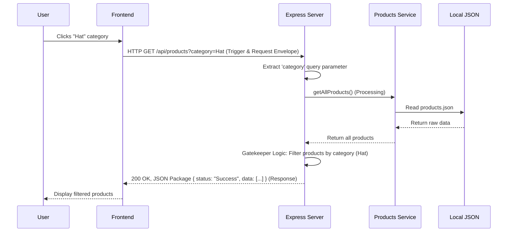

# Product Filter Design

## 1. Contract Table

| Endpoint | Method | Query Parameters | Description | Success Response | Error Response |
| :--- | :--- | :--- | :--- | :--- | :--- |
| `/api/products` | GET | `category` (optional, string) | Fetches a list of products. If `category` is provided, filters the products to match the specified category. | `200 OK`   `{ "status": "Success", "data": [...] }` | `500 Internal Server Error`   `{ "status": "Fail", "message": "Failed to retrieve products" }` |

## 2. Sequence Diagram

## 3. GenAI Prompts

**Prompt 1: Implementing the Express Route and Controller**
> Write an Express.js route and controller to handle a GET request for `/api/products`.
> 1. Trigger: It should be accessible via `GET /api/products`.
> 2. Request: Accept an optional query parameter for `category`.
> 3. Processing: Implement "Gatekeeper" logic to fetch all products from a service layer, and if the `category` query parameter is present, filter the fetched data by that category (case-insensitive).
> 4. Response: Send back a JSON "Package" with a "Status" field (`"Success"` or `"Fail"`) and a "data" field containing the filtered products. In case of an error, send a 500 status code with an appropriate error message.
> Make sure to add comments explaining the logic flow (Trigger, Request, Processing, Response).
