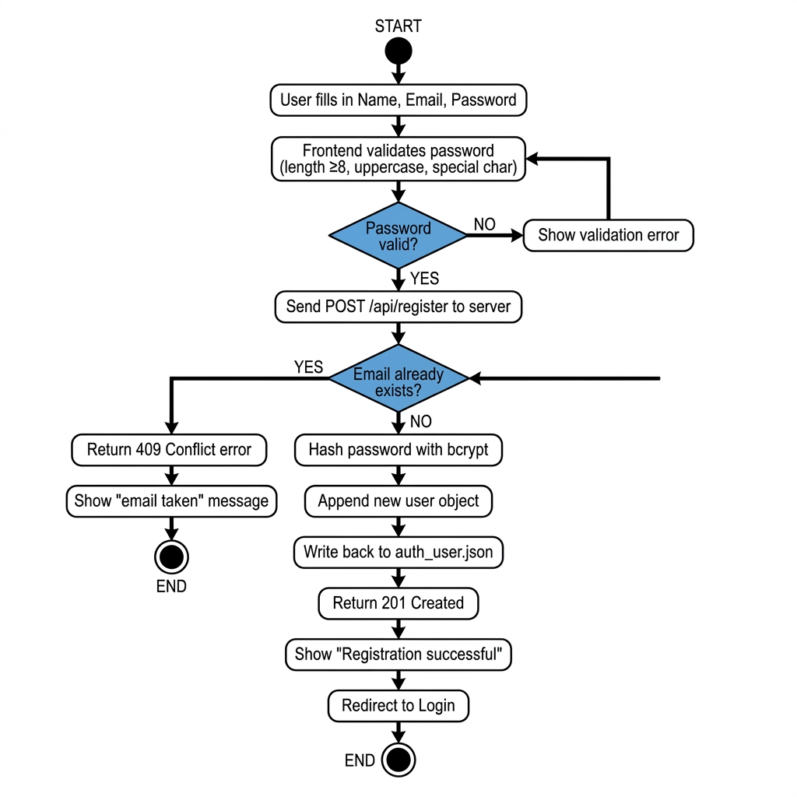
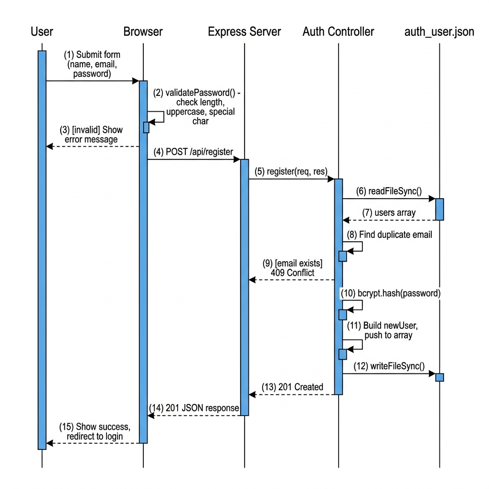

# Register Feature Design

## 1. Contract Table

| Item | Details |
| :--- | :--- |
| **Endpoint** | `POST /api/register` |
| **Description** | Creates a new user account. Checks for duplicate email on the backend and stores the new user in `auth_user.json`. |
| **Request Body** | `{ "name": string, "email": string, "password": string }` |
| **Username field** | `email` — the email address is used as the unique username |
| **Frontend Validation** | ✅ Password ≥ 8 characters · ✅ At least one uppercase letter (A-Z) · ✅ At least one special character (`!`, `@`, `#`, `$`, `%`, `^`, `&`, `*`) |
| **Backend Validation** | Checks `auth_user.json` for an existing record with the same email (case-insensitive) |
| **Password Storage** | Plain-text password is **never** stored. Hashed with `bcrypt` (10 salt rounds) before writing to disk |
| **Success Response** | `201 Created` → `{ "message": "Registration successful! You can now log in.", "userId": <number> }` |
| **Error — Missing fields** | `400 Bad Request` → `{ "message": "Name, email, and password are required." }` |
| **Error — Duplicate email** | `409 Conflict` → `{ "message": "An account with that email already exists." }` |
| **Error — Server fault** | `500 Internal Server Error` → `{ "message": "Internal server error." }` |

---

## 2. Activity Diagram

> Shows the step-by-step flow of the registration process, including both frontend decisions and backend processing.

**Key decision points:**
1. **Password valid?** (Frontend) — if NO, show inline errors and stop; if YES, proceed to network request.
2. **Email already exists?** (Backend) — if YES, return 409 and show "email taken"; if NO, hash and store.

---

## 3. Sequence Diagram

> Shows the message flow between every participant involved in a registration request.

**Participants:**

| Participant | Role |
| :--- | :--- |
| **User** | Person interacting with the browser |
| **Browser** (`register.html` + `register.js`) | Collects form data, runs client-side validation, sends the API call |
| **Express Server** (`auth.js` route) | Receives the HTTP request and dispatches to the controller |
| **Auth Controller** (`authController.js`) | Contains all business logic — duplicate check, hashing, file write |
| **`auth_user.json`** | Flat-file "database" that persists all user records |

---

## 4. GenAI Prompts

### Prompt 1 — Express.js Route (`auth.js`)

> Using the following Contract Table, write an Express.js route file for user registration:
>
> - **Endpoint:** `POST /api/register`
> - **Controller method:** `authController.register`
> - **Existing route:** `POST /api/login` already exists in the same file.
>
> Requirements:
> 1. Import `express` and create a `Router`.
> 2. Import the `authController`.
> 3. Register the `POST /api/login` route pointing to `authController.login`.
> 4. Register the `POST /api/register` route pointing to `authController.register`.
> 5. Export the router with `module.exports`.
> 6. Add a comment above each route explaining what it does (Trigger).

---

### Prompt 2 — Backend Logic (`authController.js` — `register` function)

> Using the following Contract Table and Sequence Diagram, write an async Express controller function called `register` in Node.js.
>
> **Contract:**
> - Input: `{ name, email, password }` from `req.body`
> - Database: read/write `auth_user.json` using `fs.readFileSync` / `fs.writeFileSync`
> - Duplicate check: search users array for matching email (case-insensitive); return `409` if found
> - Password hashing: use `bcrypt.hash(password, 10)`
> - New user shape: `{ id, email, username: email, password: hashedPassword, firstName: name, registrationDate: new Date().toISOString() }`
> - ID generation: `Math.max(...users.map(u => u.id)) + 1`
> - Success: `res.status(201).json({ message, userId })`
>
> Requirements:
> 1. Follow the Trigger → Request → Processing → Response comment pattern.
> 2. Add inline comments explaining every significant step.
> 3. Handle all error cases (missing fields = 400, duplicate = 409, server fault = 500).
> 4. Export both `login` and `register` from `module.exports`.

---

### Prompt 3 — Frontend Logic (`register.js`)

> Using the following Contract Table, write a vanilla JavaScript file (`register.js`) for a registration page.
>
> Requirements:
> 1. Define a `validatePassword(password)` function that checks:
>    - Length >= 8 characters
>    - At least one uppercase letter (`/[A-Z]/`)
>    - At least one special character (`/[!@#$%^&*]/`)
>    - Returns `{ valid: boolean, errors: string[] }`
> 2. Define `updatePasswordChecklist(password)` that updates DOM elements `#rule-length`, `#rule-uppercase`, `#rule-special` with check/cross icons and CSS classes `rule-pass` / `rule-fail`.
> 3. On `DOMContentLoaded`, attach:
>    - An `input` event on `#password` that calls `updatePasswordChecklist`.
>    - A `submit` event on `#registerForm` that validates, then sends `POST /api/register`, and shows the result in `#message`.
> 4. Add comments explaining every section (collect fields, validate, send request, handle response).
